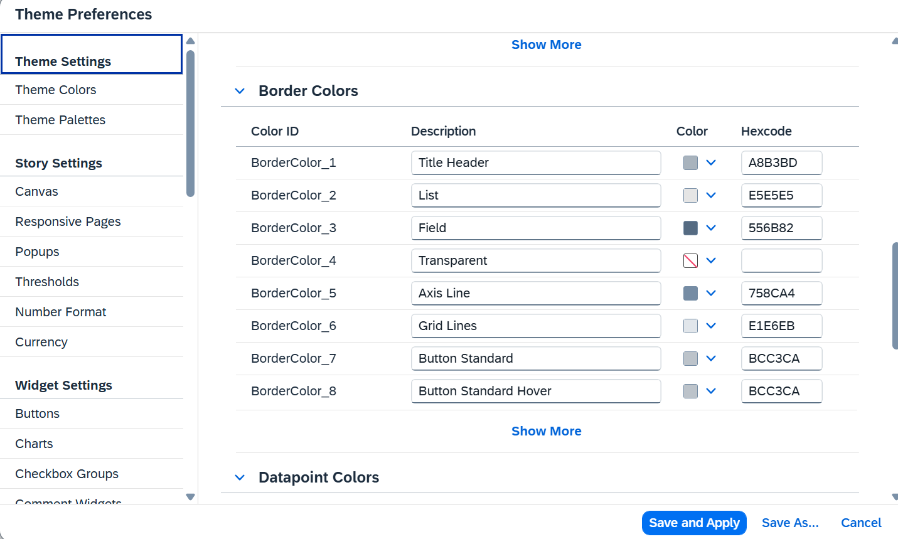
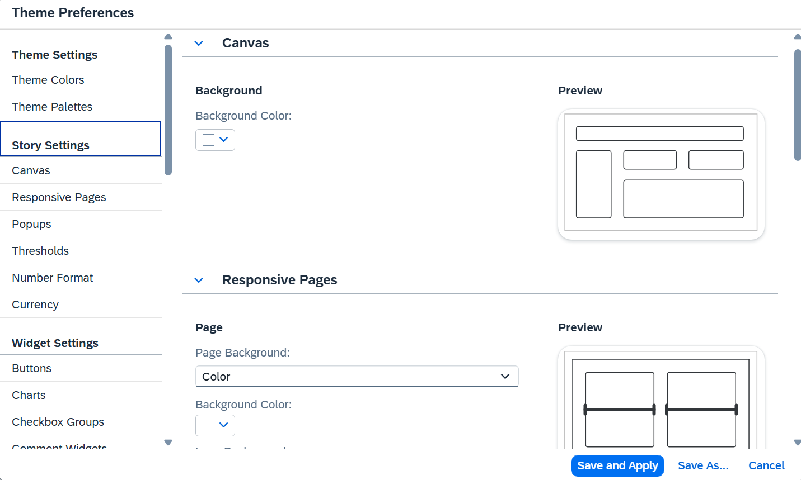
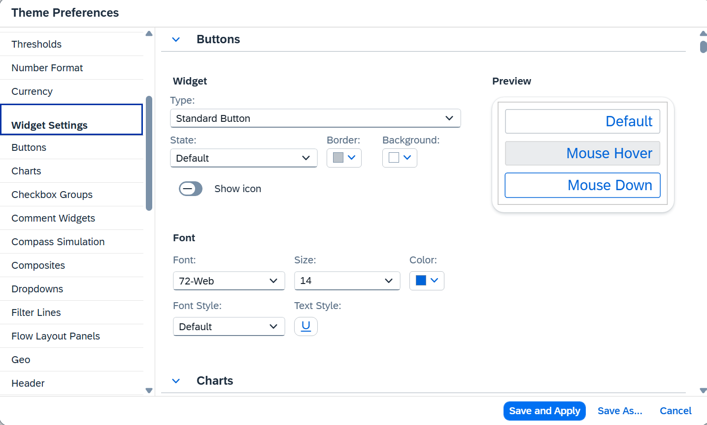
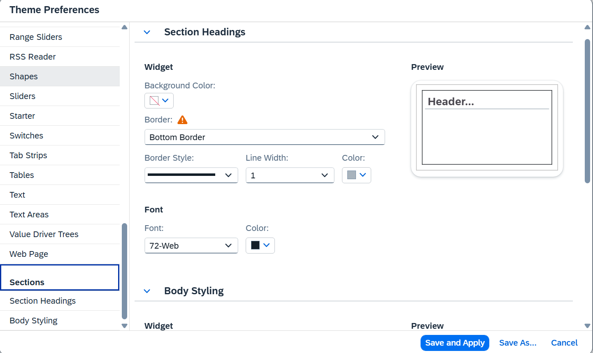

# SAC Brand Theme Automation Toolset

## Purpose

This toolset is intended to automate the creation of an SAP Analytics Cloud
(SAC) Theme from a company's brand assets. The target workflow converts brand
guidelines, colour references, typography, and dashboard mockups into a reusable
SAC Theme that report authors can apply consistently.

The browser component, `sac-theme-tools.js`, provides the bridge between SAC and
the automation. It exports the active Theme Preferences into a structured JSON
baseline and imports an updated JSON file back into SAC. It does not read or
change story data, models, filters, or variables.

The AI Skill in `./skill/` is the theme-generation component. It reads the
exported SAC baseline together with company brand assets and dashboard mockups,
then generates a new import-ready JSON file. Its responsibilities include:

- mapping brand colours to SAC Theme Colors and named swatch IDs;
- constructing standard, gradient, sequential, diverging, waterfall, variance,
  and single-colour Theme Palettes as applicable;
- applying company fonts and typography across relevant Story, Widget, and
  Section settings; and
- preserving the SAC-specific structure and identifiers required for a
  successful import.

## End-to-end workflow

1. **Manually export a baseline from SAC.** Open either the SAC default theme or
   the relevant Local Theme in Theme Preferences, install the console utility,
   and export the full JSON file. This first step is intentionally manual.
2. **Generate the branded theme JSON.** Provide the exported baseline, company
   brand assets, and dashboard mockups to the AI Skill in `./skill/`. The skill
   creates a revised JSON file containing the colour mappings, palettes, fonts,
   and related settings.
3. **Review the generated JSON.** Check the proposed swatch assignments,
   typography, palette ordering, and any Story, Widget, or Section changes.
4. **Validate and import into SAC.** Use this console utility's dry-run and
   import options to apply the generated file to the open Theme Preferences
   dialog.
5. **Verify and save the reusable theme.** Reopen Theme Preferences after import
   where necessary, inspect representative widgets, then save the result as the
   appropriate Local Theme or reusable SAC Theme.

Starting from an exported baseline is important because SAC's internal setting
schema and available providers can change between tenant releases. The baseline
gives the AI Skill the exact structures, named colour slots, palette definitions,
and widget settings supported by the current tenant.

## Browser console utility

`sac-theme-tools.js` performs the manual export, validation, and import stages
described above.

## Settings groups and options

The SAC Theme Preferences dialog divides the exported JSON into four scopes.
Theme Colors and Theme Palettes are always exported and imported. Story, Widget,
and Section settings have independent export and import flags.

| SAC scope | JSON property | Export option | Export default | Import option | Import default |
| --- | --- | --- | --- | --- | --- |
| Theme Colors and Palettes | `theme.colors`, `theme.palettes` | Always included | Included | Always applied | Applied |
| Story Settings | `storySettings` | `includeStorySettings` | `true` | `applyStorySettings` | `false` |
| Widget Settings | `widgetSettings` | `includeWidgetSettings` | `true` | `applyWidgetSettings` | `false` |
| Sections | `sectionSettings` | `includeSectionSettings` | `true` | `applySectionSettings` | `false` |

### Theme Settings



Theme Settings contain the named font, background, border, and datapoint colour
swatches, together with the chart palette definitions. They provide the central
colour map used by the other settings. These properties are always present in an
export and always applied during import.

### Story Settings



Story Settings cover Canvas, Responsive Pages, Popups, Thresholds, Number
Format, and Currency. Export is controlled by `includeStorySettings`; import is
controlled independently by `applyStorySettings`.

### Widget Settings



Widget Settings cover controls and visualizations such as Buttons, Charts,
Tables, Text, Input Controls, and Panels. This scope contains much of SAC's font
and typography configuration as well as backgrounds, borders, interaction
states, chart axes, gridlines, labels, and widget-specific palettes. Export is
controlled by `includeWidgetSettings`; import is controlled independently by
`applyWidgetSettings`.

### Sections



Section settings cover Section Headings and Body Styling, including background,
border, and heading-font properties. Export is controlled by
`includeSectionSettings`; import is controlled independently by
`applySectionSettings`.

The AI Skill may update any of these four scopes. It should preserve provider
IDs, setting types, paths, named swatch references, and other structural fields
from the exported baseline, changing only the values required to express the
company brand.

## Install in the browser console

1. Open an SAC story in edit mode.
2. Open **Theme Preferences** and leave the dialog open.
3. Open Chrome DevTools, select **Console**, paste the complete contents of
   `sac-theme-tools.js`, and press Enter.

Chrome may require you to type `allow pasting` before it accepts pasted console
code.

## Export

By default, export downloads Theme Colors, Theme Palettes, Story Settings,
Widget Settings, and Section Settings:

```js
await SACThemeTools.exportJSON();
```

The resulting JSON contains `storySettings`, `widgetSettings`, and
`sectionSettings` as independent sections. To choose a recognizable file name:

```js
await SACThemeTools.exportJSON({
  fileName: "Glencore-SAC-theme-full.json",
});
```

To export only Theme Colors and Theme Palettes, explicitly disable the three
additional sections:

```js
await SACThemeTools.exportJSON({
  includeStorySettings: false,
  includeWidgetSettings: false,
  includeSectionSettings: false,
});
```

Copy the default full export as clean, formatted JSON without downloading a
file:

```js
await SACThemeTools.exportJSON({
  download: false,
  copyToClipboard: true,
});
```

If the browser blocks clipboard access, Chrome DevTools also provides a `copy()`
command:

```js
copy((await SACThemeTools.exportJSON({ download: false })).text);
```

Do not select and copy the displayed `.text` value from the console. DevTools
renders a JavaScript string representation there, so line breaks appear as
literal `\n` escape sequences. The clipboard commands above copy the underlying
formatted text with real line breaks.

## Validate and import

Theme Colors and Theme Palettes are always validated and applied. Story, Widget,
and Section import options all default to `false`; those settings are applied
only when their corresponding option is explicitly set to `true`.

Validate a full edited file without changing the dialog:

```js
await SACThemeTools.applyJSON(editedThemeJson, {
  dryRun: true,
  applyStorySettings: true,
  applyWidgetSettings: true,
  applySectionSettings: true,
});
```

Choose an edited JSON file and apply only Theme Colors and Theme Palettes:

```js
await SACThemeTools.applyFromFile();
```

Apply selected additional groups:

```js
await SACThemeTools.applyFromFile({
  applyStorySettings: true,
  applyWidgetSettings: true,
  applySectionSettings: true,
});
```

Each option can be enabled separately. For example, apply only Widget settings:

```js
await SACThemeTools.applyFromFile({
  applyWidgetSettings: true,
});
```

Review the result and click **Save**. To invoke SAC's Save action after applying
all groups:

```js
await SACThemeTools.applyFromFile({
  applyStorySettings: true,
  applyWidgetSettings: true,
  applySectionSettings: true,
  save: true,
});
```

Some additional-setting controls do not redraw immediately after a console
import. The underlying SAC preference model is updated through the provider's
normal model-update handler without invoking off-screen preview listeners. Save
and reopen Theme Preferences to inspect the rebuilt controls. SAC may still show
its normal overwrite or save confirmation.

## What the JSON means

- `theme.colors` contains fixed named swatches such as `FontColor_3`,
  `BackgroundColor_2`, `BorderColor_22`, and `DatapointColor_1`.
- Widget settings refer to these IDs and also retain a resolved literal color.
- `theme.palettes` contains chart palette definitions. Most definitions retain
  both swatch IDs and resolved colors; a few palette types use literal colors.
- `storySettings`, `widgetSettings`, and `sectionSettings` are present only
  when their corresponding export options are enabled.
- Import applies palettes first, then optional Story, Widget, and Section
  settings, and finally emits SAC's normal Theme Colors change event. This lets
  SAC refresh literal values linked to changed swatch IDs.
- A changed additional setting that its SAC provider cannot accept is skipped
  and reported in `additionalSettingsWarnings`.

## Compatibility and safety

This is an administrator/development convenience, not a public SAP API. It uses
private objects in the SAC web client and therefore must be re-tested after a
tenant upgrade. Export a fresh backup before importing. By default, import does
not click Save.
